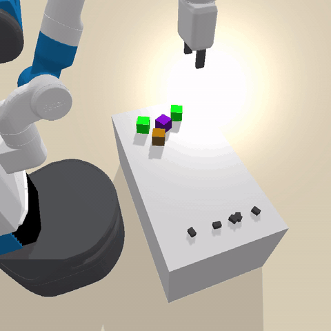
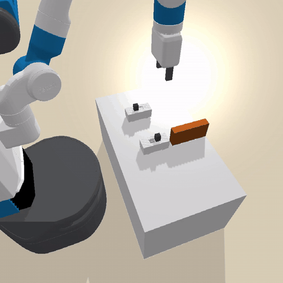
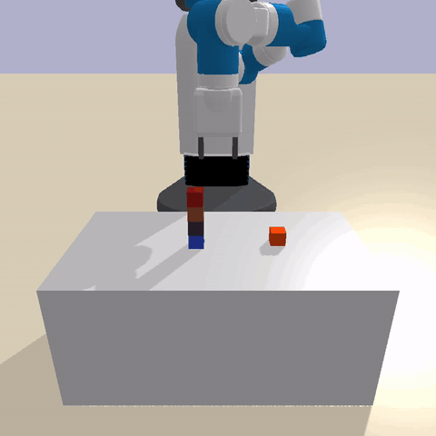
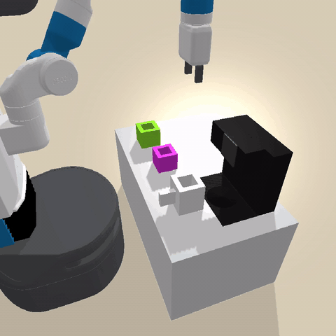
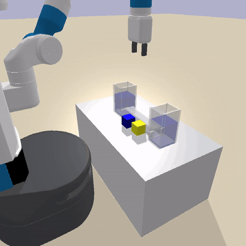
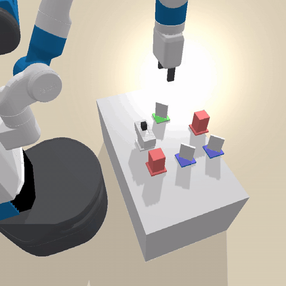

# PyBullet Environments

**RoboDisco** (Robot Model Discovery Benchmark) — a robotic
world-model learning and causal-discovery suite. The envs ship as part
of the [predicators](../../README.md) repository and are exposed
through a standard [Gymnasium](https://gymnasium.farama.org/) API.

🌐 **Project page:** <https://yichao-liang.github.io/robodisco-site/>

Each environment features a Fetch or Panda robot interacting with objects
on a tabletop. The same envs are used by predicators' planning research
code and can be consumed independently of the planner.

## Installation

From the repo root:

```bash
pip install -e .
```

This installs the agent solvers and the RoboDisco envs together. The
package is slightly heavy because it bundles both — a lighter
envs-only install is future work.

## Quick Start (Gymnasium API)

```python
from predicators import utils
from predicators.envs import gymnasium_wrapper as robodisco

# Apply parser defaults to predicators' global CFG (only needed when
# consuming the envs as a library rather than via main.py).
utils.reset_config({"num_train_tasks": 1, "num_test_tasks": 1})

robodisco.register_all_environments()
env = robodisco.make("robodisco/Blocks-v0", render_mode="rgb_array")

obs, info = env.reset()
for _ in range(50):
    action = env.action_space.sample()
    obs, reward, terminated, truncated, info = env.step(action)
    if terminated or truncated:
        break

frame = env.render()  # (H, W, 3) uint8 RGB array
env.close()
```

The Gymnasium wrapper exposes:

- `obs`: a 1-D `float32` numpy array of object features (PyBullet body ids
  and other `sim_features` are excluded).
- `action_space`: the underlying robot's joint action space, as a
  `gymnasium.spaces.Box`.
- `reward`: `1.0` when all goal predicates are satisfied, `0.0` otherwise.
- `terminated`: `True` when the goal is reached.
- `truncated`: `True` when the episode hits the 500-step limit.
- `info["state"]`: the full object-centric `predicators.structs.State`
  for the current step (predicates, types, sim state).
- `info["goal_reached"]`: shortcut for `env.goal_reached()`.

## Walkthroughs

- **Notebook:** [`notebooks/getting_started.ipynb`](../../notebooks/getting_started.ipynb)
  — interactive walkthrough with rendering.
- **Smoke script:** [`scripts/robodisco_getting_started.py`](../../scripts/robodisco_getting_started.py)
  — non-interactive smoke test that mirrors the notebook and resets every
  env to verify installation health.

## Environments

Status legend:
- **Tasks** — the env's task generator produces multiple init states and goals (✅) versus only a single fixed configuration (❌).
- **Skills** — `predicators/ground_truth_models/<env>/options.py` exposes a non-empty set of primitive options (✅) versus an empty set or no factory (❌).
- **Demos** — `python predicators/main.py --env <env_name> --approach oracle --seed 0 --num_train_tasks 1 --num_test_tasks 1 --timeout 60` solves the test task end-to-end (✅) versus failing during planning, execution, or sampler grounding (❌).

| Environment | Preview | Description | Tasks | Skills | Demos |
|---|---|---|:---:|:---:|:---:|
| `robodisco/Ants-v0` |  | Place food items near ants on a tabletop | ❌ | ✅ | ❌ |
| `robodisco/Balance-v0` |  | Balance blocks on a beam by pressing buttons | ✅ | ✅ | ❌ |
| `robodisco/Barrier-v0` |  | Move blocks past barriers to target locations | ❌ | ❌ | ❌ |
| `robodisco/Blocks-v0` |  | Stack and arrange blocks on a table | ✅ | ✅ | ✅ |
| `robodisco/Boil-v0` |  | Fill and boil water using a jug, faucet, and burner | ✅ | ✅ | ✅ |
| `robodisco/Circuit-v0` |  | Assemble circuit components (batteries, wires, switch) | ❌ | ✅ | ✅ |
| `robodisco/Coffee-v0` |  | Operate a coffee machine: plug in, brew, pour, serve | ✅ | ✅ | ❌ |
| `robodisco/Cover-v0` |  | Place blocks to cover target regions | ✅ | ✅ | ✅ |
| `robodisco/Domino-v0` |  | Set up domino chains with fans, balls, and ramps | ✅ | ✅ | ✅ |
| `robodisco/Fan-v0` |  | Use fans to blow lightweight objects to goals | ✅ | ✅ | ✅ |
| `robodisco/Float-v0` |  | Float light blocks by filling a container with water | ❌ | ✅ | ✅ |
| `robodisco/Grow-v0` |  | Grow plants by watering them | ✅ | ✅ | ✅ |
| `robodisco/Laser-v0` |  | Align lasers and mirrors to hit targets | ❌ | ✅ | ❌ |
| `robodisco/MagicBin-v0` |  | Sort objects into magic bins that transform them | ❌ | ❌ | ❌ |
| `robodisco/Switch-v0` |  | Toggle switches to open doors and move objects | ❌ | ❌ | ❌ |

The Demos column was verified by running the oracle command above on
every env. Failing envs typically need additional `CFG` overrides or
hit known issues (missing NSRTs, sampler-grounding errors, or
execution drift); they may still be useful as targets for skill or
NSRT learning research. A handful of envs (`Circuit`, `Cover`, `Laser`,
`Switch`) also currently fail to instantiate through the Gymnasium
wrapper with parser defaults — pass `cfg_overrides={...}` to
`robodisco.make(...)` or call `utils.update_config({...})` before
`make()` to supply the missing fields.

## Per-environment configuration

The RoboDisco envs read from predicators' global `CFG` object, which
normally gets populated by `predicators/main.py`'s command-line parser.
For library use, set it explicitly:

```python
from predicators import utils
utils.reset_config({
    "num_train_tasks": 5,
    "num_test_tasks": 5,
    "blocks_num_blocks_train": [3, 4],
    "blocks_num_blocks_test": [4, 5],
})
```

You can also pass overrides per-make via the wrapper:

```python
env = robodisco.make(
    "robodisco/Blocks-v0",
    render_mode="rgb_array",
    cfg_overrides={"blocks_num_blocks_train": [4]},
)
```

See `predicators/settings.py` for the full list of available CFG fields.

## Standalone API (without the gym wrapper)

Each env can be used directly via predicators' `BaseEnv` interface:

```python
from predicators import utils
from predicators.envs.pybullet_blocks import PyBulletBlocksEnv

utils.reset_config({"num_train_tasks": 5, "num_test_tasks": 5})
env = PyBulletBlocksEnv(use_gui=False)
state = env.reset("train", 0)
for _ in range(50):
    action = env.action_space.sample()
    state = env.step(action)
```

This gives you direct access to `env.predicates`, `env.types`,
`env.goal_predicates`, `env.get_train_tasks()`, etc., without flattening
the state into a `Box` observation.

## Developing new envs

For a guide on writing new PyBullet environments, see
[`docs/pybullet_env_guide.md`](../../docs/pybullet_env_guide.md).

## Predicators planning framework

These envs also power the predicators bilevel-planning research codebase.
See the [top-level README](../../README.md) for details.
